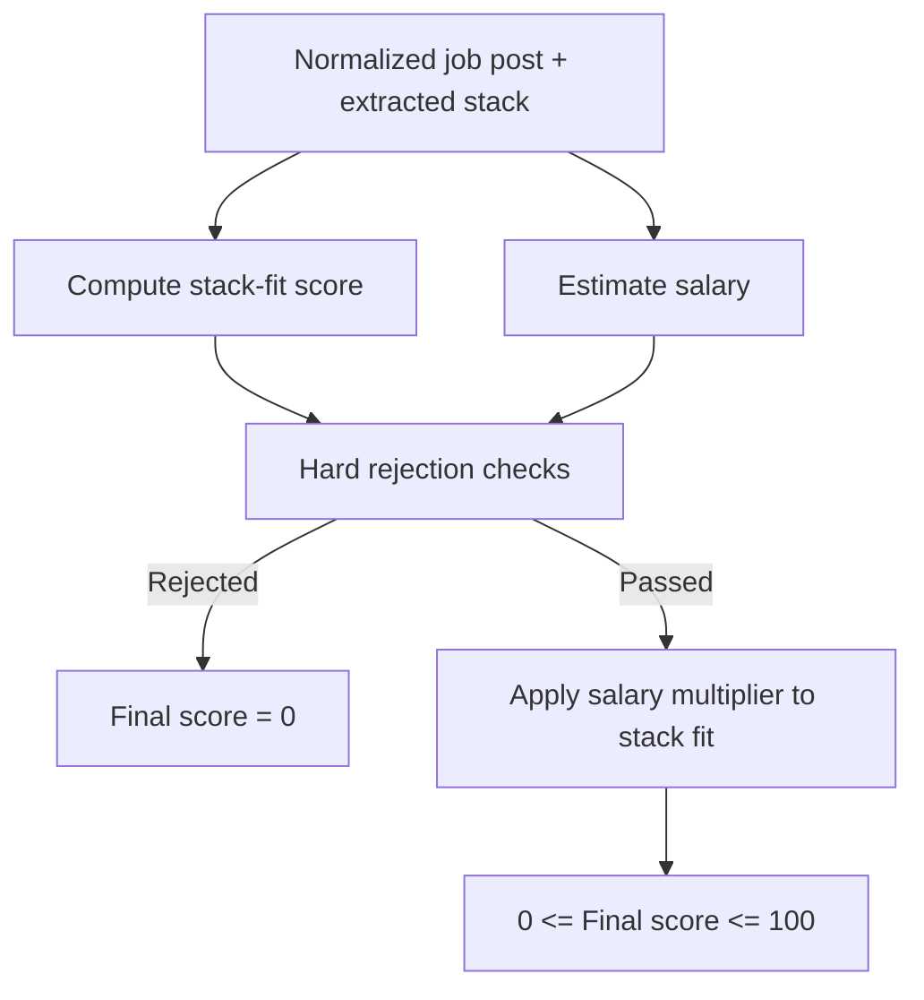
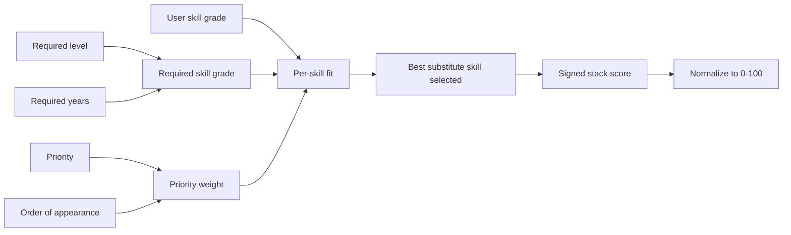

# AI Job Triage Tool

## IN PROGRESS!!!  USE AT YOUR OWN RISK!!!
## TODO

- Finish `apply_to_jobs` in `src/job_triage/job_apply/app.py`
- Remove JobApplicationInfo
- Check if we can reduce fields in JobApplication
- Add this to prose LLM call: Do not refer to the company by name unless it appears explicitly in the provided post text or metadata.
Use "your team", "the team", or "this role" instead.
- Remove JobScore?  Do we actually need this since we're persisting job assessment stuff?
- Have AI write code to extract all skills from job_scores to add relevant ones to my stack with grades.
- Restructure code (e.g. Separate app.py into smaller files).  Reorganize functions so entrypoints are first then helper functions are ordered as they are called.
- In job_apply, only apply to jobs updated within last two weeks (make this number constant across the whole repo)
    - Or Add function to change RawJob.is_active to False when date_posted > 2 weeks old.
- Add work authorization deterministic rendering
- Look into disk space management since the raw_jobs table may become large over time.
- Implement fixed experience bullet points to be chosen by LLM, and not created.
- Make sure the B2B Remote in USA or elsewhere is taken into account.

[](https://github.com/elliottbache/job_triage/actions/workflows/ci.yaml)
[](https://codecov.io/github/elliottbache/job_triage)
[](https://github.com/elliottbache/job_triage/releases)
[](https://opensource.org/licenses/MIT)


## Short description

An AI-assisted job triage tool that turns raw job posts into structured data, evaluates how well a role matches your skills, and helps you prioritize which applications are worth your time.

## What this project demonstrates

This project demonstrates a practical AI-assisted backend workflow for job triage. It uses structured LLM outputs, Pydantic validation, deterministic scoring logic, and golden-case evals to turn messy job-post data into normalized assessments.

The model handles bounded extraction and classification, while application code owns scoring, salary estimation, shortlist/discard rules, and validation.

- Python package structure with typed schemas and clear workflow boundaries
- LLM-based job-post extraction and assessment with validation/retry handling
- App-layer scoring for stack fit, salary fit, seniority, location, and work arrangement
- Golden JSON eval cases for regression testing extraction and assessment behavior
- Designed as a controlled workflow, not an autonomous auto-apply agent

## Overview
This tool is separated into three parts: job_search, job_assess, job_apply.

## Job search

The job-search layer discovers and normalizes listings from applicant tracking systems. The current Ashby provider flow is:

1. Brave Search finds `jobs.ashbyhq.com` URLs for the configured search phrase.
2. Ashby company slugs are extracted from those URLs and persisted in SQLite as `ATSBoard` rows.
3. Board inserts use SQLite `ON CONFLICT DO NOTHING` on `(provider, board_slug)`, so repeated discovery runs are idempotent.
4. The provider reads all saved Ashby boards, calls Ashby's public posting API for each board with compensation included, and validates each raw payload into an `AshbyJob`.
5. Each job keeps both the original decoded provider payload and the validated Pydantic model in `ParsedAshbyJob`.
6. Jobs are filtered by remote/workplace rules, configured keywords, maximum offered salary, and posting freshness. `updated_at` is preferred over `published_at` when deciding freshness.
7. Matching jobs are synced to `RawJob` rows for persistence. The job-search boundary ends at database writes; assessment code later maps active, unapplied raw jobs into `JobPostSource` objects.

Raw Ashby job persistence is designed to be repeatable. `_sync_raw_job_atomic()` first tries an insert with SQLite conflict handling. If the row already exists, it updates only when the incoming content hash differs from the stored hash. This preserves the original provider payload as canonical JSON in `provider_payload_json` while avoiding unnecessary rewrites for unchanged listings.

`RawJob` intentionally stores a small set of normalized columns next to the full provider payload. `title`, `date_posted`, and `source_url` make common database queries and UI views possible without reparsing the provider JSON. `normalized_metadata_json` stores deterministic facts derived during ingestion, such as Ashby `min_salary` and `max_salary`, so assessment can use those values without recalculating provider-specific compensation rules. The full Ashby payload remains in `provider_payload_json`; bulky content such as the description is reparsed from that payload when `job_assess` builds a `JobPostSource`.

## Job assess

### LLM extraction and assessment

The LLM workflow is implemented in `src/job_triage/job_assess/llm/analyze.py`. The public entry point is `analyze_job_post()`.

The model returns one structured `LLMJobPostAnalysis` with two main sections:

1. `extraction`: source-backed facts copied from the job post, such as contact data, stack mentions, location text, work arrangement text, seniority text, and salary mention.
2. `assessment`: normalized buckets derived from those extracted facts, such as location constraint, engagement type, employment type, work arrangement, seniority, role family, stack required level, and stack priority.

The prompt asks the model to fill stack `source_text` first. For each extracted skill, `source_text` should contain the complete sentence, list item, title phrase, or metadata value that mentions that skill. Narrower fields such as `required_level_text`, `required_years`, `priority_text`, and `substitutes` should then be derived from that same local evidence rather than from an unrelated part of the post.

#### Analysis function flow

`analyze_job_post()` runs the workflow in this order:

1. `_create_system_message()` and `_create_user_message()` build the LLM instructions.
2. `convert_base_model_to_json_schema(LLMJobPostAnalysis)` builds the structured output schema.
3. `run_claude()` calls the model.
4. `LLMJobPostAnalysis.model_validate()` validates the model response.
5. `_sort_stack_mentions_from_text()` cleans, repairs, deduplicates, and orders extraction stack evidence.
6. `_deduplicate_stack_assessments()` merges duplicate assessment stack items.
7. `_repair_assessment_from_extraction()` deterministically repairs assessment fields that should come from cleaned extraction evidence.
8. `_salary_mention_to_annual_eur_range()` converts extracted salary evidence into an annual EUR salary range.
9. `_recommended_base_resume_for_role_family()` selects the resume variant for the assessed role family.
10. `JobPostAnalysis.model_validate()` returns the final validated analysis object.

#### Deterministic extraction checks

The LLM is allowed to interpret the job post, but several fields are corrected in application code because they must obey stricter contracts than the model reliably follows.

`_sort_stack_mentions_from_text()` applies these extraction checks:

- `_clean_extraction_text_fields()` removes extracted text snippets that are not copied from the title, description, or metadata. This applies to stack `source_text`, `required_level_text`, `priority_text`, `location_text`, `engagement_text`, `employment, `work_arrangement_text`, and `seniority_text_text`.
- `_clean_seniority_text()` removes seniority snippets that are source-backed but semantically wrong. It keeps explicit seniority labels such as `Senior`, `Lead`, `Principal`, `Junior`, `Mid`, `Experienced`, and explicit years phrases such as `7+ years`, but drops role-family titles such as `Backend Engineer`.
- `_deduplicate_stack_mentions()` merges duplicate skill mentions case-insensitively, preserving combined evidence text, substitutes, and the most restrictive required years.
- `_repair_explicit_substitutes()` keeps substitute relationships only when the source contains explicit alternative wording such as `A or B`, `A/B`, `A / B`, or `A, B, ... or N`. Shared evidence such as `Python and PostgreSQL` is not treated as a substitute relationship.
- `_repair_stack_source_text()` fills missing stack `source_text` from all source snippets that mention the extracted skill.
- `_repair_stack_required_level_text()` fills missing `required_level_text` only from same-segment evidence that contains a clear level or depth qualifier such as `strong`, `deep`, `familiarity`, `knowledge of`, or `no prior experience`.
- `_repair_stack_priority_text()` fills missing `priority_text` from same-segment priority wording such as `required`, `preferred`, `desirable`, `important`, `plus`, or `helpful`. This handles shared priority sentences such as `Docker and CI/CD experience are preferred`.
- `_clean_stack_priority_text()` removes `priority_text` when the priority phrase does not appear in the same sentence or list item as the skill.
- `_repair_stack_required_years()` fills missing `required_years` from skill-adjacent numeric years evidence. When one sentence has both broad and skill-specific years, it uses the years phrase closest to each skill mention, so `7+ years of software engineering experience, including at least 4 years working on Python backend systems` maps Python to `4`, not `7`.
- `_skill_match_candidates()`, `_skill_indexes_in_text()`, and `_skill_index_positions_in_text()` normalize skill matching for plural forms and punctuation-heavy skills such as `CI/CD`.
- After repair, stack mentions are sorted by first source occurrence and `_clean_stack_mention_evidence()` normalizes evidence separators.

#### Deterministic assessment checks

`_repair_assessment_from_extraction()` makes assessment fields obey the cleaned extraction evidence:

- If cleaned `seniority_text` is `null`, assessment `seniority` is forced to `Unclear`.
- If `seniority_text` contains explicit years, `_seniority_from_years_text()` maps those years to the deterministic seniority bucket.
- Stack assessment `required_level` is derived from that skill's cleaned `required_level_text` with `_required_level_from_text()`. The model should not independently infer level from raw job text during assessment.
- Stack assessment `priority` is derived from that skill's cleaned `priority_text` with `_priority_from_text()`. Required years, required level, seniority, section headers, and responsibilities do not affect priority.

This split is intentional: the model finds and labels candidate evidence, while deterministic code enforces exact-source fields, same-sentence evidence rules, substitute constraints, and assessment values that can be reliably derived from extraction.

#### Eval cases

Golden evals live under `tests/job_assess/llm/evals/`. Each case contains:

- `job_post.md`: human-readable fixture
- `expected_source.json`: normalized source object
- `expected_extraction.json`: expected extracted evidence
- `expected_assessment.json`: expected normalized assessment

The current cases cover:

| Eval case | Main behavior covered |
| --- | --- |
| `cfd_role` | Engineering-domain stack extraction, CFD-related skills, technical methods, remote EU constraints, and salary fallback behavior. |
| `explicit_worldwide` | Worldwide remote wording, explicit compensation, contractor engagement, no-prior-experience signals, and alternative/specialized technical skills. |
| `heavy_stack` | Large stack lists, priority ordering, broad helpful-but-not-essential evidence, and many low-priority tools. |
| `hybrid_in_country_only` | Hybrid location constraints, in-country work requirements, animation/VFX domain wording, qualified versus base skill evidence, and level-text separation. |
| `lead_role` | Lead-style responsibilities, seniority from years, backend role-family precedence, shared strong evidence for multiple skills, and preferred tool evidence. |
| `recruiter_contact_info_messy` | Recruiter names, multiple emails, company-domain contact preference, remote-first wording, and messy contact text. |
| `remote_eu_only_implied` | Remote-within-Europe location constraints, null seniority evidence, backend role-family classification, and work arrangement extraction. |
| `spain_hybrid` | Madrid hybrid constraints, metadata extraction, employee/full-time classification, and basic backend stack signals. |
| `title_ambiguous_seniority_implied` | Ambiguous software/backend title handling, backend role-family precedence, skill-specific years inside broader years evidence, and shared priority for Docker/CI/CD. |

## Job apply

The job-application layer turns an assessed job into application materials. It currently uses two LLM calls:

1. Resume selection chooses which trusted resume inventory items are relevant to the job.
2. Application prose writes a resume summary and cover-letter body from the selected evidence.

The workflow is intentionally evidence-bound. The LLM can choose and phrase content, but it should not invent projects, roles, bullets, skills, employers, dates, tools, metrics, degrees, locations, certifications, or awards. Deterministic validation checks the LLM outputs before they are accepted.

### Resume selection LLM call

The resume-selection call is implemented in `src/job_triage/job_apply/llm/selection.py`. The model receives:

- the trusted resume inventory JSON
- the job post title, description, and metadata
- the assessed stack mentions for the job

The model returns only stable inventory identifiers:

- selected project IDs
- selected experience role keys
- selected experience bullet IDs
- selected core skill group names

The call does not ask the model to write new resume content. It only selects from existing, approved inventory.

#### Resume selection validation

The selector validates the LLM response before mapping selected IDs back to renderable resume content:

- Project IDs must exist in the trusted inventory.
- Core skill group names must exactly match inventory group names.
- Experience role keys must exist in the trusted inventory.
- Experience bullet IDs must belong to the selected inventory role.
- Stack mentions from the job should be covered by a selected core skill group when there is a matching inventory group.

If validation fails, the selector retries once with evidence about what went wrong. Retry context includes invalid identifiers and, for missing stack coverage, the job stack mention plus the valid core skill groups that could cover it.

### Application prose LLM call

The prose call is implemented in `src/job_triage/job_apply/llm/prose.py`. It receives:

- the job post
- the application fit context, including per-skill fit scores
- the expanded selected resume content produced from approved inventory selections

It returns structured JSON with:

- `summary`: a resume-style summary
- `cover_letter_text`: cover-letter body text only

The prose prompt requires grounded writing from the expanded selected resume content. The job post can guide targeting and prioritization, but candidate claims must come from selected resume evidence.

#### Application prose validation

The prose validator checks the generated summary and cover letter before accepting them:

- Resume summary must be 45-80 words.
- Cover letter body must be 220-320 words.
- Cover letter must include every meaningful job-title token.
- Resume summary must include at least two thirds of meaningful job-title tokens, rounded down with a minimum of one token.
- The stack mention pool is built from `stack_comparisons` where `skill_fit > 0` and the skill is supported by the expanded selected resume content.
- Cover letter must include at least 80% of that positive-fit, evidence-supported stack mention pool, rounded down.
- Resume summary must include at least one highest-fit positive stack skill that is supported by the expanded selected resume content.
- Cover letter must mention at least one selected project by project label.
- Cover letter must mention at least one selected job experience, using either selected company name or selected job title.

If validation fails, the prose call retries once with targeted correction evidence. Retry context is added only for failed checks. It can include:

- actual summary or cover-letter word counts and required ranges
- missing job-title words
- highest-fit supported stack mentions missing from the summary
- supported stack mentions already included in the cover letter
- remaining supported stack mentions, ordered by fit score
- selected project labels that could satisfy the project mention requirement
- selected company names and job titles that could satisfy the experience mention requirement

### Apply LLM evals

Apply evals live under `tests/job_apply/llm/evals/`. Each case contains selection fixtures and prose fixtures:

- `resume_context.json`: input for the resume-selection call
- `inventory.json`: trusted resume inventory
- `selection_expected_output.json`: expected selected inventory IDs
- `prose_context.json`: input for the prose call
- `prose_expected_output.json`: expected phrase groups for prose checks

`tests/job_apply/llm/run_apply_evals.py` runs the selection and prose calls for each case, then writes grouped results to `tests/job_apply/llm/evals/apply_eval_results.json`. Selection failures and prose failures are reported separately.

#### Resume selection eval checks

Selection eval checks are implemented in `tests/job_apply/llm/eval_helpers/selection_checks.py`:

- `is_inventory_valid`: every selected project, core skill group, experience role, and bullet ID must exist in the inventory, and selected bullets must belong to the selected role.
- `is_projects`: every expected project ID must be selected.
- `is_core_skills`: every expected core skill group must be selected.
- `is_experience_roles`: every expected experience role key must be selected.
- `is_bullets_by_role`: every expected bullet ID must be selected under the expected role.

#### Application prose eval checks

Prose eval checks are implemented in `tests/job_apply/llm/eval_helpers/prose_checks.py`:

- `is_summary_required_phrases`: the summary must include at least one required phrase from at least half of required phrase subgroups, rounded down.
- `is_summary_forbidden_phrases`: the summary must include zero forbidden phrases.
- `is_summary_top_fit_skill`: the summary must include at least one stack skill with the highest fit score.
- `is_cover_letter_required_phrase_total`: the cover letter must include at least four total required phrase hits.
- `is_cover_letter_required_phrase_groups`: the cover letter must include at least one required phrase from every required phrase subgroup.
- `is_cover_letter_forbidden_phrases`: the cover letter must include zero forbidden phrases.
- `is_cover_letter_high_fit_skills`: the cover letter must include every stack skill whose fit score is greater than 50. Skills with a score of exactly 50 are not required by this eval check.

These eval checks are intentionally separate from production prose validation. Production validation enforces structural and evidence rules before accepting generated prose; eval checks measure whether the model produced expected case-specific content and avoided known bad phrases.

### Scoring at a glance

The job score is calculated in two layers:

1. **Stack fit** measures how well the user's saved skills match the job's required skills.
2. **Final job fit** adjusts that stack fit using salary and hard rejection rules.

The model extracts and normalizes job-post information, but the final scoring is deterministic application logic.



#### Stack-fit calculation

Stack fit compares each extracted job skill against the user's saved skill grades.



In short:

- `required_level` and `required_years` answer: **how good do I need to be?**
- `priority` and order of appearance answer: **how much does this skill matter?**
- the user's saved skill grade answers: **how close am I to the requirement?**
- salary and hard rejection rules are applied only after stack fit is calculated.

### Grading system details

The current grading system is implemented in `src/job_triage/job_assess/app.py`. The public entry point is `assess_jobs()`, which reads active, unapplied `RawJob` rows, maps each row to a `JobPostSource`, runs LLM analysis, computes a deterministic fit score, and persists the result as a `JobScore`.

The score is calculated in three stages:

1. `_evaluate_job_fit()` calls `_compare_my_stack_to_theirs()` to compute a stack-fit score from `0` to `100`.
2. `_evaluate_job_fit()` calls `_estimate_salary()` to estimate gross annual salary, either from the job post salary range or from the fallback salary matrix.
3. `_evaluate_job_fit()` calls `_validate_seniority_location_salary()` to reject jobs that fail hard constraints. Rejected jobs receive `0`.

`assess_jobs()` skips raw jobs whose existing `JobScore.assessed_content_hash` already matches `RawJob.content_hash`. When the raw provider payload changes, the score is recalculated and upserted, so the database stores one current score per raw job.

Priority signal, required level, and required years are separate inputs to the stack-fit calculation. Required level and required years do not affect priority. Instead, `_grade_required_stack()` combines required level and required years into the required skill grade: the estimated level of ability needed for that skill on a `0` to `100` scale. `_rank_priority()` separately maps the extracted `priority_signal` to a priority weight and adjusts that weight by order of appearance within the same signal group. `_calculate_skill_fit()` then combines those two pieces by checking whether the user's saved grade meets the required grade and multiplying that result by the priority weight.

In other words, required level and required years answer "how good do I need to be at this skill?", while `priority_signal` answers "how much should this skill matter in the overall score?" A required skill with a large skill gap can pull the stack-fit score down more than a bonus skill with the same gap. A required skill that the user already meets gets full credit for that priority weight.

#### Stack-fit score

`_compare_my_stack_to_theirs()` compares the extracted job skills against the user's saved skill grades in `private/my_stack.csv`.

The calculation uses these helper functions:

- `_group_all_substitute_skills()` groups skills that can substitute for each other.
- `_group_single_substitute_skill()` builds one substitute group from a skill and its listed substitutes.
- `_read_my_stack()` loads the user's saved skill grades.
- `_calculate_skill_fit()` calculates the fit contribution for one skill.
- `_grade_required_stack()` estimates the required skill grade from required level and required years.
- `_rank_priority()` weights a skill by extracted priority signal and order of appearance within the same signal group.

Required skill grades are estimated on a `0` to `100` scale:

| Requirement signal | Grade range |
| --- | --- |
| Novice | 0-0 |
| Basic | 0-30 |
| Intermediate | 30-60 |
| Advanced | 60-80 |
| Expert | 80-100 |

Required years are also mapped to a grade range:

| Required years | Grade range |
| --- | --- |
| 0 | 0-0 |
| 1 | 0-31 |
| 2 | 31-54 |
| 3 | 54-70 |
| 4 | 70-81 |
| 5 | 81-89 |
| 6 | 89-95 |
| 7 | 95-100 |

When both required level and required years are present, `_grade_required_stack()` applies them in order to the same required-grade range. It starts with the full `0` to `100` range, narrows that range using the required level, then narrows the result again using required years. The function returns the midpoint of the final narrowed range.

For example, a skill with `required_level="Basic"` first narrows the range from `0-100` to `0-30`. If that same skill also has `required_years=3`, the `3`-year range of `54-70` is applied inside the current `0-30` range, producing an approximate final range of `16-21` and a required grade of `18.5`. Required years are therefore relative to the current narrowed range, not an extra priority boost.

When neither required level nor required years is present, the required grade defaults to `20.0`.

Skill priority is calculated by `_rank_priority()` from the extracted `priority_signal`:

| Priority signal | Base weight before order adjustment |
| --- | --- |
| required | 3.0 |
| highly_preferred | 2.4 |
| preferred | 1.8 |
| bonus | 1.2 |
| not_required | 0.6 |

Skills with the same priority signal are adjusted by order of appearance. Earlier skills keep more of their priority weight; later skills in the same signal group receive a slightly lower weight. Skills with different priority signals do not reduce each other's priority weight.

If the user's grade for a skill is greater than or equal to the required grade, `_calculate_skill_fit()` gives that skill full credit for its priority weight. If the user's grade is below the required grade,
the skill contributes a negative value based on the gap.

The per-skill fit calculation is:

```text
if my_level >= required_grade:
    skill_fit = 100 * priority
else:
    skill_fit = (my_level - required_grade) * priority
```

The final stack-fit score is normalized from a signed range of `-100` to `100` into a public score from `0` to `100`, where `50` is neutral.

#### Salary estimate

`_estimate_salary()` estimates salary in one of two ways:

- If the assessment includes `salary_range`, `_estimate_salary_from_range()` uses that range.
- If no salary range is available, `_retrieve_salary_from_matrix()` looks up a fallback salary from `expected_gross_salary_matrix_eur.csv`.

`_estimate_salary_from_range()` sorts the two salary values defensively. If the stack-fit score is below `50`, it returns the lower salary. For scores from `50` to `100`, it interpolates linearly between the
lower and upper salary.

`_retrieve_salary_from_matrix()` tries salary lookup keys in this order:

1. Exact `(role_family, seniority, location_constraint)`
2. Same role and seniority with `Worldwide` location
3. Same role with `Junior` seniority and `Worldwide` location
4. `Mechanical Engineer`, `Junior`, `Worldwide`
5. Minimum salary found in the matrix

#### Hard rejection rules

`_validate_seniority_location_salary()` rejects jobs before the final score is returned.

- Seniority is `Lead` or `Principal` and the role is `Software Engineer`, `Backend Engineer`, or `Data Engineer`.
- Location constraint is `Other`.
- Work arrangement is `Onsite`.
- Estimated salary is less than `55000`.

#### Final score

If the job passes validation, `_evaluate_job_fit()` applies a salary multiplier to the stack-fit score:

```text
salary_multiplier = (salary - 55000) / 55000 / 2 + 1
final_score = int(stack_fit * salary_multiplier)
```

This means salary can raise the final score above the raw stack-fit score. A salary of `55000` uses a multiplier of `1.0` and passes validation because the salary rule is inclusive. A salary of `110000` uses a multiplier of `1.5`. A salary of `165000` uses a multiplier of `2.0`.

#### Edge cases

| Edge case | Function involved | Result |
| --- | --- | --- |
| No extracted stack skills | `_compare_my_stack_to_theirs()` | Stack fit is `100` before salary and validation rules are applied. |
| Skill is missing from `private/my_stack.csv` | `_compare_my_stack_to_theirs()` | The user's grade is treated as `0`; the skill may contribute a negative fit value. |
| Skill has substitutes | `_group_all_substitute_skills()`, `_calculate_skill_fit()` | The best-scoring skill in the substitute group is used. |
| Priority signal is missing or unknown | `_rank_priority()` | Raises `KeyError`; no grade is returned. |
| Substitute skill is named but not extracted | `_group_single_substitute_skill()` | Raises `LookupError`; no grade is returned. |
| Skill has no required level and no required years | `_grade_required_stack()` | Required grade defaults to `20.0`. |
| Required level is unknown | `_grade_required_stack()` | Falls back to the full `0-100` range for level. |
| Required years are greater than the mapped range | `_grade_required_stack()` | Uses `100-100`, effectively requiring expert-level experience. |
| Salary range values are reversed | `_estimate_salary_from_range()` | Values are sorted before salary is estimated. |
| Salary range does not contain exactly two values | `_estimate_salary_from_range()` | Raises `ValueError`. |
| No salary range is provided | `_estimate_salary()`, `_retrieve_salary_from_matrix()` | Uses the salary matrix fallback lookup. |
| Salary matrix is empty | `_retrieve_salary_from_matrix()` | Salary becomes `0`, so validation rejects the job and returns `0`. |
| Estimated salary is exactly `55000` | `_validate_seniority_location_salary()` | Passes the salary validation rule because the minimum salary is inclusive. |
| Work arrangement is `Unclear` | `_validate_seniority_location_salary()` | Not rejected by work arrangement because only `Onsite` is rejected. |
| Seniority is `Unclear` | `_validate_seniority_location_salary()` | Not rejected by seniority. |
| Lead or Principal role is `Mechanical Engineer`, `Research Engineer`, or `Other` | `_validate_seniority_location_salary()` | Not rejected by the seniority rule. |

## TODO
Create toml file with:
- City
- Acceptable distance to city for hybrid work
